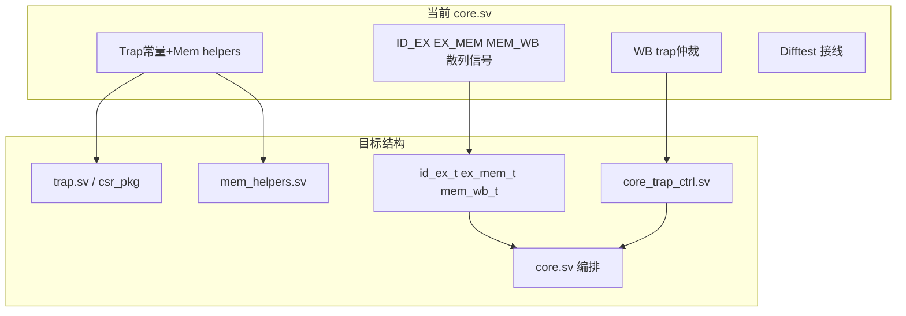

# Lab+ 前核心重构计划（Refactor_TODO 第 1–4 步）

## 当前仓库状态

| 维度 | 现状 |
|------|------|
| 分支 | 已在 [`refactor/before_labplus`](refactor/before_labplus)，基于 Lab6 提交 `b2b0555`，仅多 [`Doc/Refactor_TODO.md`](Doc/Refactor_TODO.md) |
| 工作区 | 干净（无未提交改动） |
| 验证 | [`status.md`](.agents/skills/26-arch-project-assistant/status.md) 记录 Lab1–6 仿真通过；Lab5 上板已成功 |
| RTL 规模 | [`core.sv`](vsrc/src/core.sv) **871 行**；[`core_csr.sv`](vsrc/src/core_csr.sv) 310 行；7 个 `vsrc/src/*.sv` 模块，**尚未开始任何重构** |
| lab+ 资产 | [`ready-to-run/lab+/`](ready-to-run/lab+/) 含 2/3/4 的 `.bin`；[`Makefile`](Makefile) 已有 `test-labplus-2/3/4` 目标（本次**不实现** lab+ 功能） |

### 主要痛点（为何需要重构）

[`core.sv`](vsrc/src/core.sv) 当前把以下内容揉在一起：

- 顶部 **trap 常量** + **6 个访存 helper 函数**（约 18–110 行）
- **ID/EX、EX/MEM、MEM/WB** 三段流水线寄存器，每段 bubble 赋值**重复两遍**（约 267–335 行模式）
- **WB 边界 trap/中断/ecall/mret 仲裁**（约 672–759 行）+ **Difftest 接线**（772–869 行）

lab+ 很可能在 privilege、CSR、trap 路径上继续扩展；不先拆边界，后续 diff 风险高。



---

## 执行原则（来自 Refactor_TODO）

1. **功能等价**：只搬家/封装，不改 trap、hazard、MMU 语义
2. **一步一提交**：重构与 lab+ 新功能绝不混在同一 commit
3. **一步一回归**：每步完成后跑基线测试

### 重构前基线（第 0 步，必须先做）

在 `refactor/before_labplus` 上记录输出：

```bash
make sim
make test-lab4
timeout 25s make test-lab5 || true
make test-lab6
```

通过判据：`HIT GOOD TRAP` / `Return from init! Test passed` / `Privileged test finished.` + `Exit with code = 0`

---

## 第 1 步：集中 trap 常量

**目标**：削减 [`core.sv`](vsrc/src/core.sv) 顶部噪声。

**改动**：
- 将 `CAUSE_*`、`MIP_MSIP/MTIP/MEIP`、`TRAP_INST` 等移至 [`vsrc/include/csr.sv`](vsrc/include/csr.sv) 的 `csr_pkg`，或新增 [`vsrc/include/trap.sv`](vsrc/include/trap.sv)（推荐后者，避免 `csr_pkg` 过度膨胀）
- [`core.sv`](vsrc/src/core.sv) 改为 `import` 引用，**数值一字不改**

**验证**：`make sim` + `make test-lab4` + `make test-lab6`

**提交**：`refactor(trap): centralize trap constants`

---

## 第 2 步：抽出访存 helper

**目标**：MEM 相关逻辑独立，便于 lab+ 扩展 page fault / 更多访存异常。

**改动**：
- 新建 [`vsrc/include/mem_helpers.sv`](vsrc/include/mem_helpers.sv)（或 `vsrc/src/core_mem_helpers.sv`），迁入：
  - `mem_size_from_funct3`
  - `store_strobe_from_funct3`
  - `align_store_data`
  - `extend_load_data`
  - `mem_addr_misaligned`
- 保持函数签名与语义不变；[`core.sv`](vsrc/src/core.sv) 仅改调用点

**验证**：`make sim` + `make test-lab2` + `make test-lab6`（关注 load/store misalign `[OK]`）

**提交**：`refactor(mem): extract load store helpers`

---

## 第 3 步：引入流水线 packet struct（分 3 小提交）

**目标**：消除 bubble 时重复赋值 ~30 个字段的问题。

**在 [`common.sv`](vsrc/include/common.sv) 新增**（每 struct 配 `*_bubble()` 或 `default` 常量）：

```systemverilog
typedef struct packed { ... } id_ex_t;
typedef struct packed { ... } ex_mem_t;
typedef struct packed { ... } mem_wb_t;
```

**分步替换**（每小步单独回归，**不同时改 trap/hazard 语义**）：

| 小步 | 替换对象 | 预期 core.sv 变化 |
|------|----------|-------------------|
| 3a | `ID_EX` 全部散列信号 → `id_ex_t id_ex_q` | bubble 变为 `id_ex_q <= id_ex_bubble` |
| 3b | `EX_MEM` → `ex_mem_t` | 同上 |
| 3c | `MEM_WB` → `mem_wb_t` | 同上 |

**注意**：
- exception packet（`exception_valid/cause/tval`）随 struct 一起传递
- hazard/forwarding 仍读 `id_ex_q.rs1_data` 等字段，接口保持可读

**验证（每小步）**：`make sim` + `make test-lab4` + `make test-lab6`

**提交**：
- `refactor(core): introduce id ex pipeline packet`
- `refactor(core): introduce ex mem pipeline packet`
- `refactor(core): introduce mem wb pipeline packet`

---

## 第 4 步：拆出 Trap Controller

**目标**：WB 阶段系统事件仲裁独立，lab+ 改 trap 逻辑时只动一个文件。

**新建** [`vsrc/src/core_trap_ctrl.sv`](vsrc/src/core_trap_ctrl.sv)：

**输入**（组合逻辑，无寄存器）：
- WB packet：`inst_valid`、`pc`、`instr`、exception 字段、`is_ecall`、`is_mret`
- `priv_mode_q`、`csr_mstatus_pre_trap`、`csr_mie_irq_q`、`csr_mip_irq_q`、`csr_mepc`、`csr_mtvec`、`csr_mret_priv`
- `swint/trint/exint`、`fetch_wait_q`、`mem_wait_q`
- 辅助函数：`mstatus_mie_after_wb`、`ecall_cause`（可留在 core 或一并迁入）

**输出**（保持与原信号名/语义一致）：
- `commit_fire_wb`、`reg_write_wb_fire`、`csr_write_wb_fire`
- `trap_commit_wb`、`mret_commit_wb`、`csr_trap_wen_wb`、`csr_mret_wen_wb`
- `csr_trap_mepc/mcause/mtval_wb`、`system_redirect_fire_wb`、`system_redirect_target_wb`
- `priv_mode_view`、`system_flush_front`、`system_wb_waiting`
- `trap_valid_wb`、`trap_code_wb`、`difftest_skip_wb`（暂留 core 亦可，优先迁 trap 判定）

**集成**：
- [`core.sv`](vsrc/src/core.sv) 实例化 `core_trap_ctrl`，删除对应 `always_comb` 块
- [`SimTop.sv`](vsrc/SimTop.sv) 增加 `` `include "src/core_trap_ctrl.sv" ``（Vivado 板级路径需要；Verilator 通过 `find vsrc -name '*.sv'` 自动收录）
- [`VTop.sv`](vsrc/VTop.sv) 若板级综合报错，同样补 include

**验证**：`make sim` + `make test-lab4` + `timeout 25s make test-lab5` + `make test-lab6`

**提交**：`refactor(core): extract trap controller`

---

## 预期成果

| 指标 | 重构前 | 重构后（估） |
|------|--------|--------------|
| `core.sv` 行数 | 871 | ~550–650 |
| 新增文件 | — | `trap.sv`、`mem_helpers.sv`、`core_trap_ctrl.sv` + 3 个 pipeline typedef |
| trap 修改入口 | 散落在 core WB 段 | `core_trap_ctrl.sv` + `core_csr.sv` |
| lab+ 准备度 | 低 | 结构清晰，可在独立模块加 S-mode/delegation/page fault |

**本次刻意不做**（留待 lab+ 前或 lab+ 并行）：
- 第 5 步 Difftest adapter 隔离
- 第 6 步 CSR 文件分区整理
- 第 7 步 总线/MMU 边界审查（除非回归暴露问题）

---

## 风险与缓解

| 风险 | 缓解 |
|------|------|
| pipeline struct 改错字段顺序 | 每小步只改一段寄存器；Lab4 对 Difftest 极敏感 |
| trap controller 时序变化 | 纯组合模块，输入输出与原 assign 一一对应，不改 `always_ff` |
| Vivado 找不到新模块 | 在 [`SimTop.sv`](vsrc/SimTop.sv) / [`VTop.sv`](vsrc/VTop.sv) 显式 `include` |
| 与 lab+ 功能混杂 | 严格一步一 commit；第 4 步完成后更新 [`Refactor_TODO.md`](Doc/Refactor_TODO.md) 勾选 1–4 |

---

## 完成后的 lab+ 入口建议

重构完成后、开始 lab+ 功能前：
1. 跑一遍 `test-labplus-2/3/4` 记录**当前失败点**（作为 lab+ 基线，预期多数未通过）
2. 在 `core_trap_ctrl.sv` / `core_csr.sv` 扩展 S-mode trap、delegation、page fault
3. 第 5–7 步可在 lab+ 开发间隙按需补上
