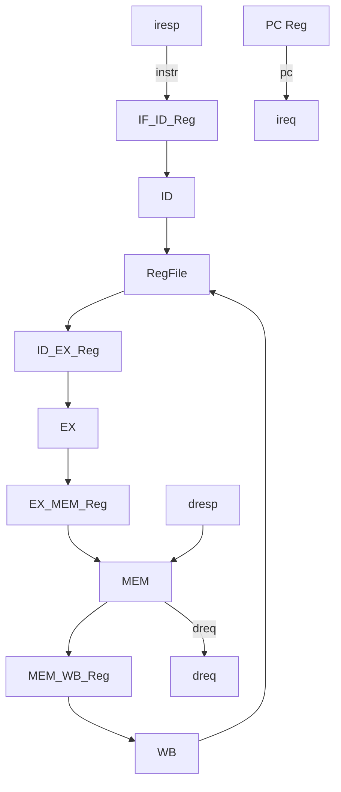

# Lab1 Phase 1 骨架搭建实现计划

## 目标与约束

- **目标**：在 [vsrc/src/core.sv](vsrc/src/core.sv) 中建立 5 级流水线物理结构，不要求通过测试。
- **红线**：段间寄存器用 `always @(posedge clk)` + `<=`；阶段内用组合逻辑 + `=`；禁止 `*`、`/`；禁止越级连线。

---

## 1. 寄存器堆 (RegFile)

在 `core` 内部实现 32x64 位寄存器堆：

- 2 读口（rs1、rs2）、1 写口（WB 阶段）
- x0 恒为 0：读 rs1/rs2 时若地址为 0 则输出 0
- 写口：`we && (wa != 0)` 时写入 `wa`
- 使用 `logic [63:0] rf [31:1]` 存储，`always @(posedge clk)` 写，组合逻辑读

---

## 2. 段间寄存器信号规划


**IF_ID**：`pc`, `instr`（32 位，来自 iresp.data）  
**ID_EX**：`pc`, `instr`, `rs1_data`, `rs2_data`, `rd`, `rs1`, `rs2`, `imm`, `funct3`, `funct7`, 控制信号（`alu_op`, `mem_read`, `mem_write`, `reg_write`, `wb_sel` 等）  
**EX_MEM**：`pc`, `alu_result`, `rs2_data`, `rd`, 控制信号  
**MEM_WB**：`pc`, `alu_result`, `mem_data`（来自 dresp.data）, `rd`, 控制信号  

---

## 3. 各阶段模块实现要点

### 3.1 IF (Instruction Fetch)

- **组合逻辑**：`next_pc = pc + 64'd4`（仅顺序取指，无分支）
- **输出**：`ireq.valid = ~stall`, `ireq.addr = pc`
- **输入**：`iresp.data_ok` 时锁存指令到 IF_ID
- **PC 更新**：时序逻辑，`posedge clk`：`reset` 时 `pc <= PCINIT`，否则 `pc <= next_pc`
- **Stall**：当 `ireq.valid && !iresp.data_ok` 时，PC 与 IF_ID 不更新（Phase 1 可先假设内存单周期返回，后续再完善）

### 3.2 ID (Instruction Decode)

- **组合逻辑**：从 `instr_id` 解析 `opcode[6:0]`, `rd`, `rs1`, `rs2`, `funct3`, `funct7`，以及各型立即数（I/S/B/U/J）
- **寄存器读**：`rs1_data = (rs1==0) ? 0 : rf[rs1]`，`rs2` 同理
- **控制信号**：根据 opcode 生成 `alu_op`, `mem_read`, `mem_write`, `reg_write`, `wb_sel` 等（Phase 1 可先设默认值）

### 3.3 EX (Execute)

- **ALU**：`always @(*)` 或 `assign`，根据 `alu_op`/`funct3`/`funct7` 做 `case`，默认输出 0 或 rs1
- **Phase 1**：仅搭框架，如 `case (alu_op) default: alu_result = rs1_data; endcase`

### 3.4 MEM (Memory Access)

- **Phase 1**：`dreq.valid = 1'b0`，不发起访存
- **预留**：`dreq.addr`, `dreq.size`, `dreq.strobe`, `dreq.data` 等端口

### 3.5 WB (Write Back)

- **组合逻辑**：`wb_data = (wb_sel) ? mem_data : alu_result`
- **写寄存器**：`we && (rd_wb != 0)` 时 `rf[rd_wb] <= wb_data`，在 `always @(posedge clk)` 中完成

---

## 4. 四个段间寄存器

统一写法：

```systemverilog
always_ff @(posedge clk) begin
  if (reset) begin
    // 清空或置无效
  end else if (!stall) begin
    pc_id <= pc_if;
    instr_id <= iresp.data;
    // ...
  end
end
```

- 使用 `always_ff` 或 `always @(posedge clk)`
- 仅使用 `<=`
- `reset` 时清空，`stall` 时保持

---

## 5. Difftest 连接

将 WB 阶段输出接到 Difftest：

- **DifftestInstrCommit**：`valid` = WB 有效（如 `reg_write_wb | mem_read_wb` 等），`pc` = `pc_wb`，`instr` = 从 MEM_WB 传下的 `instr`，`wen` = `reg_write_wb`，`wdest` = `rd_wb`，`wdata` = `wb_data`
- **DifftestArchIntRegState**：`gpr_0`..`gpr_31` 接寄存器堆读出（或维护一份“提交后”的架构状态）
- **DifftestTrapEvent**：Phase 1 保持 `valid=0`
- **DifftestCSRState**：Phase 1 保持占位值

注意：`instr` 需从 IF_ID 经 ID_EX、EX_MEM 传到 MEM_WB，不能越级。

---

## 6. 顶层 core 内连接关系



---

## 7. 实现顺序建议

1. 寄存器堆
2. PC 与 IF 逻辑，驱动 `ireq`
3. IF_ID_Reg
4. ID 译码与 RegFile 读
5. ID_EX_Reg
6. EX 与 ALU 框架
7. EX_MEM_Reg
8. MEM 占位（dreq.valid=0）
9. MEM_WB_Reg
10. WB 与 RegFile 写
11. 连接 Difftest
12. 检查：无 `*`/`/`，无越级连线，段间寄存器用 `<=`

---

## 8. 可选：内存就绪与 Stall（Phase 1 可简化）

若 `iresp.data_ok` 非单周期返回，可加：

- `stall = ireq.valid && !iresp.data_ok`
- `stall` 时：PC 不变，四个段间寄存器保持

Phase 1 可先假设 `data_ok` 单周期有效，若仿真异常再补 stall 逻辑。

---

## 9. 关键文件

- 所有实现均在 [vsrc/src/core.sv](vsrc/src/core.sv)
- 接口与类型见 [vsrc/include/common.sv](vsrc/include/common.sv)（`ibus_req_t`, `ibus_resp_t`, `dbus_req_t`, `dbus_resp_t`）
- 参数 `PCINIT = 64'h8000_0000` 在 common.sv
