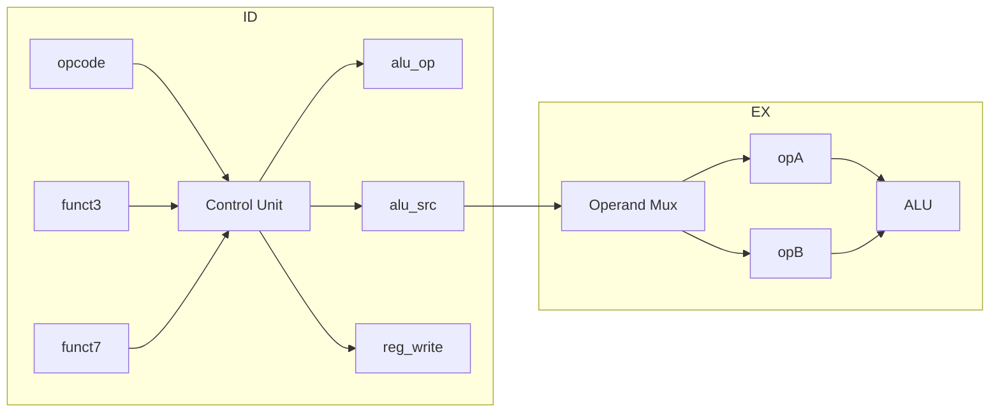

# Lab1 Phase 2 译码与执行实现计划

## 目标与范围

- **目标**：赋予 CPU 译码与算术/逻辑运算能力，使约 12 条基础整数指令正确执行
- **范围**：仅 ID + EX，不涉及 Load/Store（Phase 3）和数据冒险（Phase 3）
- **红线**：禁止 `*`、`/`；ALU 与译码均为组合逻辑

---

## 1. 指令集清单（基于 lab1-test.S）


| 指令    | opcode  | funct3 | funct7  | 类型  | alu_src | 说明              |
| ----- | ------- | ------ | ------- | --- | ------- | --------------- |
| ADD   | 0110011 | 000    | 0000000 | R   | 0       | rs1 + rs2       |
| SUB   | 0110011 | 000    | 0100000 | R   | 0       | rs1 - rs2       |
| ADDW  | 0111011 | 000    | 0000000 | R-W | 0       | 32 位加后符号扩展      |
| SUBW  | 0111011 | 000    | 0100000 | R-W | 0       | 32 位减后符号扩展      |
| ADDI  | 0010011 | 000    | -       | I   | 1       | rs1 + imm       |
| ADDIW | 0011011 | 000    | -       | I-W | 1       | 32 位加 imm 后符号扩展 |
| AND   | 0110011 | 111    | 0000000 | R   | 0       | rs1 & rs2       |
| OR    | 0110011 | 110    | 0000000 | R   | 0       | rs1 | rs2       |
| XOR   | 0110011 | 100    | 0000000 | R   | 0       | rs1 ^ rs2       |
| ANDI  | 0010011 | 111    | -       | I   | 1       | rs1 & imm       |
| ORI   | 0010011 | 110    | -       | I   | 1       | rs1 | imm       |
| XORI  | 0010011 | 100    | -       | I   | 1       | rs1 ^ imm       |


---

## 2. ALU 操作码编码（建议）

在 [vsrc/src/core.sv](vsrc/src/core.sv) 中定义 `alu_op` 枚举或常量：


| alu_op   | 操作           |
| -------- | ------------ |
| ALU_ADD  | 加法（64 位）     |
| ALU_SUB  | 减法           |
| ALU_ADDW | 32 位加 + 符号扩展 |
| ALU_SUBW | 32 位减 + 符号扩展 |
| ALU_AND  | 与            |
| ALU_OR   | 或            |
| ALU_XOR  | 异或           |


---

## 3. ID 阶段修改

### 3.1 新增信号

- `alu_src_id`：0 = ALU B 端接 rs2_data，1 = 接 imm

### 3.2 替换占位控制逻辑（约第 104-109 行）

将 `assign alu_op_id = 4'b0` 等替换为 `always_comb` 控制块：

```systemverilog
always_comb begin
    alu_op_id    = ALU_ADD;   // default
    alu_src_id   = 1'b0;
    reg_write_id = 1'b0;
    mem_read_id  = 1'b0;
    mem_write_id = 1'b0;
    wb_sel_id    = 1'b0;

    case (opcode_id)
        7'b0010011: begin  // I-type ALU
            reg_write_id = 1'b1;
            alu_src_id   = 1'b1;
            case (funct3_id)
                3'b000: alu_op_id = ALU_ADD;
                3'b100: alu_op_id = ALU_XOR;
                3'b110: alu_op_id = ALU_OR;
                3'b111: alu_op_id = ALU_AND;
                default: ;
            endcase
        end
        7'b0011011: begin  // ADDIW
            reg_write_id = 1'b1;
            alu_src_id   = 1'b1;
            alu_op_id    = ALU_ADDW;
        end
        7'b0110011: begin  // R-type
            reg_write_id = 1'b1;
            case (funct3_id)
                3'b000: alu_op_id = (funct7_id[5]) ? ALU_SUB : ALU_ADD;
                3'b100: alu_op_id = ALU_XOR;
                3'b110: alu_op_id = ALU_OR;
                3'b111: alu_op_id = ALU_AND;
                default: ;
            endcase
        end
        7'b0111011: begin  // R-type W
            reg_write_id = 1'b1;
            alu_op_id    = (funct7_id[5]) ? ALU_SUBW : ALU_ADDW;
        end
        default: ;
    endcase
end
```

### 3.3 段间寄存器传递 alu_src

在 ID_EX_Reg、EX 阶段增加 `alu_src_ex` 的传递与使用。

---

## 4. EX 阶段修改

### 4.1 操作数选择（Operand Mux）

```systemverilog
logic [63:0] alu_opA, alu_opB;
assign alu_opA = rs1_data_ex;
assign alu_opB = alu_src_ex ? imm_ex : rs2_data_ex;
```

### 4.2 ALU 核心逻辑

```systemverilog
always_comb begin
    alu_result_ex = 64'b0;
    case (alu_op_ex)
        ALU_ADD:  alu_result_ex = alu_opA + alu_opB;
        ALU_SUB:  alu_result_ex = alu_opA - alu_opB;
        ALU_AND:  alu_result_ex = alu_opA & alu_opB;
        ALU_OR:   alu_result_ex = alu_opA | alu_opB;
        ALU_XOR:  alu_result_ex = alu_opA ^ alu_opB;
        ALU_ADDW: begin
            logic [31:0] res_32;
            res_32 = alu_opA[31:0] + alu_opB[31:0];
            alu_result_ex = {{32{res_32[31]}}, res_32};
        end
        ALU_SUBW: begin
            logic [31:0] res_32;
            res_32 = alu_opA[31:0] - alu_opB[31:0];
            alu_result_ex = {{32{res_32[31]}}, res_32};
        end
        default: alu_result_ex = alu_opA;
    endcase
end
```

注意：`logic [31:0] res_32` 在 `always_comb` 内声明需符合 SystemVerilog 规范；若工具不支持，可改为在块外声明。

### 4.3 W 型指令要点

- 只对 `opA[31:0]` 与 `opB[31:0]` 运算
- 将 32 位结果的 bit 31 符号扩展到高 32 位
- 正确形式：`res_64 = {{32{res_32[31]}}, res_32}`

---

## 5. 段间寄存器变更与透传完整性（参考 Phase2_PlanFix）

### 5.1 新增信号

- `alu_src_id`（ID 输出）、`alu_src_ex`（ID_EX 锁存）：ALU B 端选择 imm 或 rs2

### 5.2 ID_EX_Reg 透传清单（必须全部锁存）

以下信号需从 ID 经 ID_EX_Reg 传递到 EX 及后续阶段，缺一不可：


| 信号                       | 用途                 | Phase 1 已有 |
| ------------------------ | ------------------ | ---------- |
| alu_op_ex                | ALU 运算类型           | 是          |
| alu_src_ex               | 操作数 B 选择           | **否，需新增**  |
| reg_write_ex             | 写寄存器使能，传至 WB       | 是          |
| rd_ex                    | 目的寄存器编号            | 是          |
| rs1_ex, rs2_ex           | 源寄存器编号，Phase 3 前递用 | 是          |
| imm_ex                   | 立即数                | 是          |
| rs1_data_ex, rs2_data_ex | 寄存器数据              | 是          |


实现时逐项核对：每个在后续阶段会用到的信号都已在 ID_EX_Reg 中打拍传递。

---

## 6. ImmGen 位宽验证（参考 Phase2_PlanFix）

I 型立即数（如 ADDI）为 12 位 `instr[31:20]`，**必须符号扩展到 64 位**后再送入流水线。

- **错误**：只扩展到 32 位，负数立即数高 32 位为 0，结果错误
- **正确**：`imm_id = {{52{instr_id[31]}}, instr_id[31:20]}`（52+12=64 位）

Phase 1 已实现（约第 85 行），Phase 2 实现后需复核无误。

---

## 7. 移位指令说明（若扩展）

若 12 条指令包含 SLL/SRL/SRA/SLLW/SRLW/SRAW/SLLI/SRLI/SRAI：

- **逻辑右移**：`>>`
- **算术右移**：`>>>`，且操作数需为有符号，如 `$signed(opA) >>> shamt`
- **W 型移位**：移位量仅取 `opB[4:0]`（5 位）
- **64 位移位**：移位量取 `opB[5:0]`（6 位）

当前 lab1-test.S 未含移位，Phase 2 可不实现；若测试用例包含则按上述规则补充。

---

## 8. 数据流示意




---

## 9. 实现顺序

1. 定义 `alu_op` 常量（或 localparam）
2. 在 ID 中实现控制逻辑，生成 `alu_op_id`、`alu_src_id`、`reg_write_id`
3. 在 ID_EX_Reg 中增加 `alu_src_ex` 的传递
4. 在 EX 中实现操作数选择 Mux
5. 在 EX 中实现 ALU（含 W 型）
6. 复核 ImmGen 与 ID_EX 透传完整性
7. 运行 `make test-lab1` 验证

---

## 10. 验证要点

- 单条指令追踪：如 `ADDI x1, x0, 10` 应得到 x1 = 10
- W 型：`ADDIW x1, x0, 10` 应得到 x1 = 64'h0000_0000_0000_000a
- 全局搜索确认无 `*`、`/`
- 确认 ALU 与译码均在 `always_comb` 或 `assign` 中，无 `posedge clk`

---

## 11. 避坑要点（参考 Phase2_PlanFix）


| 问题        | 错误做法                | 正确做法                                       |
| --------- | ------------------- | ------------------------------------------ |
| ID_EX 透传  | 只加 alu_src，忽略其他     | 核对 alu_op、reg_write、rd、rs1、rs2 等均透传        |
| ImmGen 位宽 | 12 位扩展到 32 位        | 必须扩展到 64 位：`{{52{inst[31]}}, inst[31:20]}` |
| 算术右移      | 用 `>>` 或未 `$signed` | 用 `>>>` 且 `$signed(opA)`                   |


---

## 12. 关键文件

- [vsrc/src/core.sv](vsrc/src/core.sv)：ID 控制逻辑（约 104-109 行）、EX ALU（约 166-174 行）、ID_EX 传递 `alu_src`
- [vsrc/include/common.sv](vsrc/include/common.sv)：ImmGen 已在 Phase 1 实现，需复核 64 位扩展

