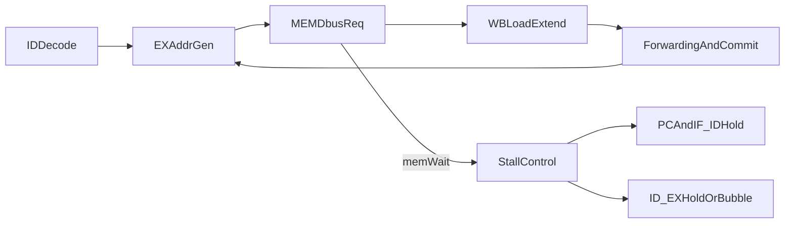

# Lab2 可行性分析与实现计划

## 结论

当前 `Lab2` 现有计划 **可行**，而且与仓库当前五级流水骨架是对得上的；不需要推翻重做，也 **不需要先大规模重构**。最合理的策略是基于现有 `IF/ID/EX/MEM/WB` 骨架，在 `[vsrc/src/core.sv](vsrc/src/core.sv)` 和 `[vsrc/src/core_decode.sv](vsrc/src/core_decode.sv)` 上做增量补齐。

但需要把参考计划修正为“**四阶段主线 + 三个额外检查点**”的实现法：

- 主线仍然是：译码与地址生成 -> load/store 数据拼装 -> dbus 握手停顿 -> load-use 联调。
- 额外检查点必须补上：`lui` 支持、`store` 写数据前递、Difftest 提交与 dbus stall 的配合。

## 为什么说它可行

仓库当前已经具备 Lab2 的关键基础：

- `[vsrc/src/core.sv](vsrc/src/core.sv)` 已经有 `ID/EX`、`EX/MEM`、`MEM/WB` 三级寄存器，且 `mem_read`、`mem_write`、`wb_sel` 已经在流水线上传递。
- `[vsrc/include/common.sv](vsrc/include/common.sv)` 已经定义了 `dbus_req_t` / `dbus_resp_t` 与 `MSIZE1/2/4/8`，总线抽象不需要重建。
- `[vsrc/SimTop.sv](vsrc/SimTop.sv)` 已经把 `core`、`DBusToCBus`、`CBusArbiter` 连好，Lab2 不需要改仿真顶层连线。
- `[vsrc/src/core_hazard_unit.sv](vsrc/src/core_hazard_unit.sv)` 已经有基础的 load-use 检测；`[vsrc/src/core_forwarding_unit.sv](vsrc/src/core_forwarding_unit.sv)` 已经有 EX 输入前递框架。

当前真正阻塞 Lab2 的，不是架构缺失，而是关键行为还没落地：

```250:255:vsrc/src/core.sv
assign dreq.valid  = 1'b0;
assign dreq.addr   = 64'b0;
assign dreq.size   = MSIZE8;
assign dreq.strobe = 8'b0;
assign dreq.data   = 64'b0;
```

以及 `[vsrc/src/core_decode.sv](vsrc/src/core_decode.sv)` 目前只对 load/store 参与了立即数生成，没有把它们真正接成 `mem_read` / `mem_write` / `wb_sel` 的控制路径。

## 对现有参考计划的可行性修正

### 保留的部分

`[Doc/Lab2/Reference_Lab2-实现计划参考.md](Doc/Lab2/Reference_Lab2-实现计划参考.md)` 的四阶段顺序基本正确：

- 先把地址和控制信号做对。
- 再把 load/store 的字节对齐、掩码、扩展做对。
- 再处理 `dreq` / `dresp` 握手与停顿。
- 最后联调 load-use hazard。

这个顺序适合当前仓库，因为现在最缺的是 **MEM 行为落地**，而不是流水线框架本身。

### 必须补充的部分

1. 不能只盯着 load/store。根据 `[Doc/Lab2/Requirements_Lab-2.md](Doc/Lab2/Requirements_Lab-2.md)` 与 `ready-to-run/lab2/lab2-test.S`，`lui` 也是 Lab2 必测的一部分，必须在 decode 里一起补齐。
2. 现有前递只覆盖 ALU 两个输入，不保证 `store` 的写数据源一定正确。`store` 的 `rs2` 数据需要单独检查并补旁路，否则前一条刚写寄存器、下一条就 `sw/sd` 时容易写旧值。
3. 现有 `stall` 只明确处理了取指等待：

```185:186:vsrc/src/core.sv
assign fetch_wait = ireq.valid && !iresp.data_ok;
assign stall = load_use_hazard || fetch_wait;
```

Lab2 还需要引入数据访存等待条件，否则 `dbus` 多周期返回时，前端和提交流程会失配。
4. `MEM/WB` 当前直接把 `dresp.data` 收进 `mem_data_wb`，但还没有基于 `funct3` 做 `lb/lbu/lh/lhu/lw/lwu/ld` 的截取与符号/零扩展；因此需要把访存宽度语义明确带到 WB。

## 推荐实现路径

### 阶段 1：补齐译码与访存微操作定义

目标：让 `ID` 阶段能明确区分 `load/store/lui`，并把 Lab2 所需最少信息传下去。

改动重点：

- 在 `[vsrc/src/core_decode.sv](vsrc/src/core_decode.sv)` 中补齐：
  - `LOAD`：`mem_read=1`、`wb_sel=1`、`reg_write=1`、`alu_src=1`、`alu_op=ADD`
  - `STORE`：`mem_write=1`、`reg_write=0`、`alu_src=1`、`alu_op=ADD`
  - `LUI`：单独支持写回高 20 位立即数
- 保留现有立即数生成逻辑，但要确认 `S`/`I` 型扩展无误。
- 在 `[vsrc/src/core.sv](vsrc/src/core.sv)` 中，确保 `funct3` 至少能进入 EX/MEM，最好继续进入 MEM/WB，供宽度和符号扩展使用。

完成标志：

- 从代码结构上，load/store 不再只是“有 imm 但没控制信号”的半接线状态。
- `lui` 不再是 Lab2 的隐藏缺口。

### 阶段 2：实现 store 拼装与 load 提取

目标：先把“理想单周期下”的读写数据语义做正确，再叠加握手。

改动重点：

- 在 `[vsrc/src/core.sv](vsrc/src/core.sv)` 的 MEM 段，根据 `alu_result_mem[2:0] + funct3_mem` 计算：
  - `dreq.size`
  - `dreq.strobe`
  - `dreq.data` 的左移对齐
- 读取时保持 `strobe = 0`，并在 WB 前完成：
  - 按地址低位右移截取目标字节/半字/字/双字
  - 对 `lb/lh/lw` 做符号扩展
  - 对 `lbu/lhu/lwu` 做零扩展
- 对齐规则以 `[vsrc/include/common.sv](vsrc/include/common.sv)` 注释和 `[Doc/Lab2/Requirements_Lab-2.md](Doc/Lab2/Requirements_Lab-2.md)` 为准：总线看到的 `addr` 保留原始低位，`data/strobe` 负责对齐。

完成标志：

- 代码层面已经具备正确的 load/store 数据语义，即使暂时不考虑多周期等待，也能说明 `dreq` 应该怎么发、`wb_data` 应该怎么得。

### 阶段 3：接通 dbus 握手并统一 stall 语义

目标：让 MEM 级真正等待 `dresp.data_ok`，同时保持请求稳定、冻结前端、不重复提交。

改动重点：

- 在 `[vsrc/src/core.sv](vsrc/src/core.sv)` 引入 `mem_wait` 或等价条件，例如“当前 MEM 有有效 load/store 且数据未完成”。
- 重新定义全局 stall，使其覆盖：
  - `fetch_wait`
  - `mem_wait`
  - `load_use_hazard`
- 设计冻结策略时，核心原则是：
  - 正在等待的 MEM 请求保持稳定。
  - PC、IF/ID、ID/EX 不应在等待期间继续前推。
  - Difftest 的 `commit_valid_wb` 不能因为 stall 重复提交同一条指令。
- 若当前 `EX/MEM`、`MEM/WB` 的 `!fetch_wait` 推进条件会与 `mem_wait` 冲突，需要一起改成统一的“是否允许流水向后推进”判定。

建议实现方式：

- 不额外引入复杂状态机，先用“MEM 段指令驻留 + 请求组合输出 + 以前级冻结保持稳定”的最小方案实现；只有当 `addr_ok/data_ok` 语义要求更细时，再细化。

完成标志：

- 代码结构能明确回答：访存未完成时，哪些寄存器 hold，哪些寄存器推进，哪些信号必须稳定。

### 阶段 4：补强数据相关冒险

目标：让 load-use 和 store-data 依赖都在 Lab2 下成立。

改动重点：

- 保留 `[vsrc/src/core_hazard_unit.sv](vsrc/src/core_hazard_unit.sv)` 现有 load-use 检测骨架，重点确认在引入 `mem_wait` 后仍然成立。
- 补 `store` 数据旁路，避免 `rs2_data_mem` 使用旧值。实现上有两条等价路线，推荐第一条：
  - 路线 A：在 EX 阶段就生成“已前递后的 store_data”，再锁存进 EX/MEM。
  - 路线 B：在 MEM 阶段额外做一次针对 store-data 的旁路选择。
- 推荐路线 A，因为它与现有 `[vsrc/src/core_forwarding_unit.sv](vsrc/src/core_forwarding_unit.sv)` 结构更一致，也更容易控制时序和行为边界。

完成标志：

- `load` 后一条使用该寄存器的指令能正确停顿后继续执行。
- `addi x1,...` 紧跟 `sw x1,...` 这类链路不会把旧值写入内存。

### 阶段 5：按 Lab2 目标做最小验证闭环

目标：用最小代价快速判断故障属于哪一类。

验证顺序：

1. 先做代码检查，确认 `decode`、`MEM`、`WB` 信号链闭合。
2. 跑 `[Makefile](Makefile)` 中的 `make test-lab2`。
3. 若失败，优先按以下顺序定位：
  - 早期失败且落在 `lui` 或地址基值异常：先查 decode
  - 读写结果整体错位：先查 `dreq.data` / `strobe` / 地址低位对齐
  - 某些 `lb/lbu/lh/lhu/lw/lwu` 错：查截取与扩展
  - 仅在相关依赖序列错：查 load-use / store-data forwarding
  - 长时间卡住或重复提交：查 `mem_wait` 与 `commit_valid_wb`
4. 若运行通过，再根据 `Makefile` 中 `DIFFTEST_OPTS = DELAY=0 # remove on lab 2` 这一提示，确认是否需要去掉该选项以匹配 Lab2 的最终环境预期。

## 建议的文件改动范围

主改文件：

- `[vsrc/src/core_decode.sv](vsrc/src/core_decode.sv)`
- `[vsrc/src/core.sv](vsrc/src/core.sv)`

次要改动候选：

- `[vsrc/src/core_forwarding_unit.sv](vsrc/src/core_forwarding_unit.sv)`
- `[vsrc/src/core_hazard_unit.sv](vsrc/src/core_hazard_unit.sv)`

原则上不建议先改：

- `[vsrc/SimTop.sv](vsrc/SimTop.sv)`
- `difftest/` 框架文件
- 总线转换器与仲裁器

## 简化的数据流示意




## 计划采用的默认策略

本计划默认采用“**最小改动、优先通过 `make test-lab2`**”的策略：

- 不先做抽象化的访存微码重构。
- 不先扩展到 Lab3 风格控制流。
- 只补齐 Lab2 必要控制、数据通路和停顿逻辑。

如果后续实现中发现 `core.sv` 因信号过多而明显失控，再把 load/store 对齐和扩展逻辑提炼成局部 helper 或小模块。