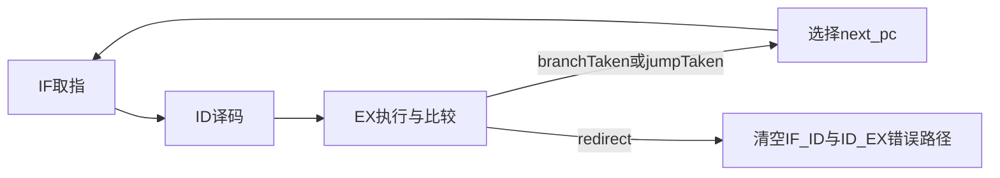

# 完成 Lab3 基线计划

## 当前判断
当前仓库的稳定事实是：Lab3 基线需要支持分支、`auipc`、`jal`/`jalr`、比较/移位及 `*w` 移位类指令，并通过 `make test-lab3`，上板需单独完成，官方要求见 [https://github.com/26-Arch/26-Arch/wiki/Lab-3](https://github.com/26-Arch/26-Arch/wiki/Lab-3)。

基于代码检查得到的当前实现状态是：访存与 `lui`/基础 ALU 已接通，但控制流主链路尚未建立。`[vsrc/src/core.sv](/home/thesumst/Data2/development/ComputerOrganization/26-Arch/vsrc/src/core.sv)` 中 `next_pc` 仍固定为 `pc + 4`，`[vsrc/src/core_decode.sv](/home/thesumst/Data2/development/ComputerOrganization/26-Arch/vsrc/src/core_decode.sv)` 虽已提取 B/J/U/JALR 立即数，但没有把 `auipc`、分支、`jal`、`jalr` 转成有效控制信号；`[vsrc/src/core_alu.sv](/home/thesumst/Data2/development/ComputerOrganization/26-Arch/vsrc/src/core_alu.sv)` 也缺少 Lab3 需要的比较与移位运算；`[vsrc/include/common.sv](/home/thesumst/Data2/development/ComputerOrganization/26-Arch/vsrc/include/common.sv)` 里的 `decode_out_t` 与 `alu_op_t` 还不够表达跳转/分支控制。

## 实施思路
优先走最小可验证路线：保持现有五级流水结构不大改，把分支/跳转判定放在 EX 阶段，用“判定后 flush 两级”的保守策略先保证正确性，再补齐相关 ALU/译码能力。这样能最大程度复用当前的旁路、load-use stall 和访存通路，避免为了性能引入过多新结构。

## 具体改动
1. 扩展公共类型与控制字段：在 `[vsrc/include/common.sv](/home/thesumst/Data2/development/ComputerOrganization/26-Arch/vsrc/include/common.sv)` 增加 Lab3 需要的 `alu_op_t` 枚举（比较、移位、32 位移位）以及 `decode_out_t` 的跳转/分支控制位，确保后续译码与执行链路有统一表达。
2. 补全译码：在 `[vsrc/src/core_decode.sv](/home/thesumst/Data2/development/ComputerOrganization/26-Arch/vsrc/src/core_decode.sv)` 正确覆盖 `beq`/`bne`/`blt`/`bge`/`bltu`/`bgeu`、`slti`/`sltiu`、`slli`/`srli`/`srai`、`sll`/`slt`/`sltu`/`srl`/`sra`、`slliw`/`srliw`/`sraiw`、`sllw`/`srlw`/`sraw`、`auipc`、`jal`、`jalr` 的控制与写回来源选择。重点处理三类特殊语义：`auipc = pc + imm`、`jal/jalr` 写回 `pc + 4`、`jalr` 目标地址最低位清零。
3. 扩展执行能力：在 `[vsrc/src/core_alu.sv](/home/thesumst/Data2/development/ComputerOrganization/26-Arch/vsrc/src/core_alu.sv)` 加入有符号/无符号比较与 64/32 位移位；若 `auipc`/链接地址回写不适合完全塞进 ALU，则在核心流水中增加清晰的 EX/WB 选择逻辑，但保持改动集中、可读。
4. 建立 PC 重定向与控制冒险处理：在 `[vsrc/src/core.sv](/home/thesumst/Data2/development/ComputerOrganization/26-Arch/vsrc/src/core.sv)` 中加入 branch/jump target 计算、taken 判定、`next_pc` 多路选择，以及在跳转成立时对 IF/ID、ID/EX 注入 bubble 的 flush 机制；同时检查它与现有 `stall`、`fetch_wait`、`mem_access_mem` 的优先级关系，避免重复提交或错误保留旧指令。
5. 按 Lab3 要求处理 Difftest skip：在 `[vsrc/src/core.sv](/home/thesumst/Data2/development/ComputerOrganization/26-Arch/vsrc/src/core.sv)` 的 `DifftestInstrCommit` 处按官方要求评估并加入 `.skip ((mem & memaddr[31] == 0))` 的等价实现，但要用当前代码里的真实 MEM 信号替换示例中的占位名字，保证只在访问低地址外设区的访存指令上跳过比对。
6. 验证闭环：先跑 `make test-lab3`，若失败就按“第一处 Difftest 不一致”回溯到译码/PC/flush/写回；必要时用 `make test-lab3 VOPT="--dump-wave"` 辅助看跳转前后两拍。`[Makefile](/home/thesumst/Data2/development/ComputerOrganization/26-Arch/Makefile)` 已提供标准入口，应坚持用它作为回归主命令。

## 范围约束
本次计划不以 `make test-lab3-extra` 为目标，因此不会主动补乘除法与 `lab1-extra` 未完成部分，除非它们意外成为 `make test-lab3` 的阻塞项。也不打算为了性能实现分支预测，先以“EX 决断 + flush”保证功能正确。

## 上板建议
上板无法在当前环境执行，因此只提供建议性步骤：
- 先在仿真中通过 `make test-lab3`，再进入板级流程，避免把板上现象和功能错误混在一起排查。
- 按 Lab3 要求确认 Difftest skip 只影响仿真，不要把“跳过过多”误当成功能正确。
- 检查板级入口与工程文件：`[vivado/test-cpu/project/project_1.xpr](/home/thesumst/Data2/development/ComputerOrganization/26-Arch/vivado/test-cpu/project/project_1.xpr)`、`[vivado/src/Basys-3-Master.xdc](/home/thesumst/Data2/development/ComputerOrganization/26-Arch/vivado/src/Basys-3-Master.xdc)`、`[vivado/src/with_delay](/home/thesumst/Data2/development/ComputerOrganization/26-Arch/vivado/src/with_delay)`。
- 准备对应的板载程序镜像，优先核对 `[ready-to-run/lab3](/home/thesumst/Data2/development/ComputerOrganization/26-Arch/ready-to-run/lab3)` 下提供的 `.coe` 文件与 BRAM 初始化配置是否一致。
- 在 Vivado 本地完成综合、实现、生成 bitstream、下载到板卡，并保存综合/实现/Hardware Manager 的关键输出截图，作为报告材料。
- 若板上失败而仿真通过，优先排查时钟/复位、BRAM 初始化文件路径、板级顶层接线、延时包装模块，而不是先怀疑核心 ISA 语义。

## 预期结果
完成后应达到的最小目标是：`make test-lab3` 出现 `HIT GOOD TRAP`，且控制流相关指令在 Difftest 下行为一致；报告与上板部分仅补充操作建议与需要收集的证据，不在当前环境中实际执行。