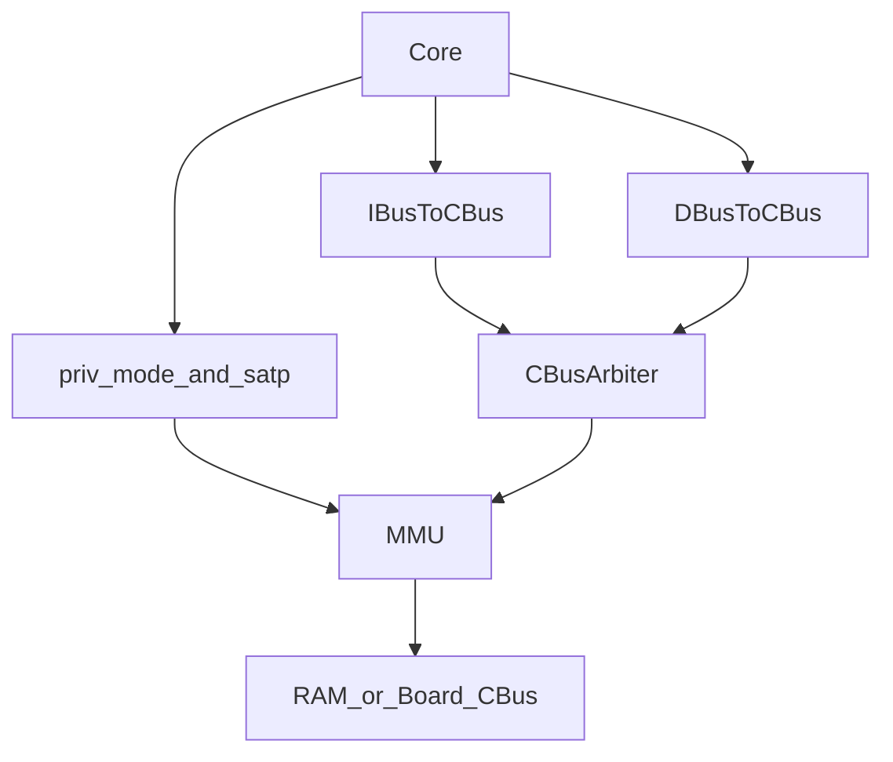

# Lab 5 实现与报告计划

## 当前判断

仓库当前 Lab1-4 基线已通过，Lab5 尚未实现：`ECALL/MRET` 被当作普通 `SYSTEM funct3=000` 空操作，`DifftestCSRState.priviledgeMode` 固定为 M 模式，`satp` 只存储不参与地址翻译，`SimTop/VTop` 当前仍是 `IBusToCBus + DBusToCBus + CBusArbiter -> RAM/外设`。

本计划默认采用官方方式 2：在仲裁后的 CBus 上插入 MMU。这样保留 [vsrc/src/core.sv](vsrc/src/core.sv) 已验证的取指/访存互斥逻辑，只需要从 core 导出 `priv_mode` 和 `satp` 给顶层 MMU。

## 实现路线

1. 建立 Lab5 基线

- 核对 [ready-to-run/lab5/](ready-to-run/lab5/) 测试输入；若 [ready-to-run/lab5/kernel.bin](ready-to-run/lab5/kernel.bin) 缺失，则从 [ready-to-run/lab5/kernel.coe](ready-to-run/lab5/kernel.coe) 按现有 [ready-to-run/lab5/bin2coe.py](ready-to-run/lab5/bin2coe.py) 的字节序规则恢复测试二进制。
- 运行 `make test-lab4` 和 `make test-lab5`，记录当前首个失败点，避免后续把既有 bug 和新实现混在一起。

2. 实现 `ECALL/MRET` 与特权级闭环

- 修改 [vsrc/include/common.sv](vsrc/include/common.sv)，在 `decode_out_t` 中增加 `is_ecall`、`is_mret`，必要时补充 `priv_mode` 常量。
- 修改 [vsrc/src/core_decode.sv](vsrc/src/core_decode.sv)，识别 `32'h00000073` 为 `ECALL`、`32'h30200073` 为 `MRET`，不写 GPR，不走普通 CSR 写回。
- 修改 [vsrc/src/core_csr.sv](vsrc/src/core_csr.sv)，增加 trap/mret 专用写入口，用于原子更新 `mepc`、`mcause`、`mstatus.MPP/MPIE/MIE`，保留现有 CSR 指令 WB 提交语义。
- 修改 [vsrc/src/core.sv](vsrc/src/core.sv)，维护动态 `priv_mode`，在 WB/提交边界触发精确 `ECALL` 和 `MRET`：`ECALL` 写 `mepc=pc_wb`、跳 `mtvec`、进入 M；`MRET` 跳 `mepc`、恢复 `MPP`。
- 扩展 flush/redirect 优先级，确保 trap/mret 清空错误路径上的年轻指令，并避免 trap 指令重复提交。
- 将 [vsrc/src/core.sv](vsrc/src/core.sv) 中 Difftest 的 `priviledgeMode` 从硬编码 `2'd3` 改为真实 `priv_mode`。

3. 实现 Sv39 MMU

- 新增 [vsrc/util/MMU.sv](vsrc/util/MMU.sv)，接口为上游 CBus 请求、下游 CBus 请求、`priv_mode`、`satp`。
- 使能条件严格按 Lab5：M 模式 bypass；`satp.mode==0` bypass；U/S 且 `satp.mode==8` 执行 Sv39 三级页表 walk。
- 页表 walk 使用 CBus 64 位读 PTE：根基址 `{satp.ppn, 12'b0}`，索引取 `vaddr[38:30]`、`[29:21]`、`[20:12]`，最终物理地址为 `{pte[53:10], vaddr[11:0]}`。
- 初版只实现固定三级页表和 Lab5 必需的 valid/leaf 处理；巨页、完整 page fault、S 模式作为非必做项，只有测试需要时再补。

4. 接入仿真与上板路径

- 修改 [vsrc/VTop.sv](vsrc/VTop.sv)，将 `CBusArbiter` 输出接入 MMU，再由 MMU 输出到外部 `oreq/oresp`；从 core 导出 `priv_mode` 和 `satp`。
- 修改 [vsrc/SimTop.sv](vsrc/SimTop.sv)，同步插入同一 MMU 拓扑，确保 Verilator 与上板路径一致。
- 保持 [vsrc/util/IBusToCBus.sv](vsrc/util/IBusToCBus.sv)、[vsrc/util/DBusToCBus.sv](vsrc/util/DBusToCBus.sv)、[vsrc/util/CBusArbiter.sv](vsrc/util/CBusArbiter.sv) 原设计不变，除非测试暴露握手问题。

5. 调试与验证

- 先跑 `make test-lab4`，确认 CSR 回归不破坏。
- 再跑 `make test-lab5`，目标输出包含 `xv6 kernel is booting`、`kinit ok`、`procinit ok`、`trapinit ok`、`plicinit ok`、`userinit ok`、`Return from init! Test passed`；最后卡住按官方要求视为正常。
- 若失败，按首个关键 mismatch 定位：优先看 PC/trap CSR/privilege，再看 MMU walk 物理地址和 load/store 数据。
- 需要时使用 `make test-lab5 VOPT="--dump-wave"` 辅助定位 trap、`satp` 写入和页表 walk。

6. 报告与提交材料

- 按 [Doc/Lab3/report.md](Doc/Lab3/report.md) 的学生视角和简洁风格撰写 [Doc/Lab5/report.md](Doc/Lab5/report.md)，内容包括实验目标、总体设计、主要实现、关键问题、仿真结果、上板验证、总结、大模型使用说明。
- 报告先写成“可补齐版”：包含代码实现说明、仿真通过输出，以及明确的上板待补充位置；Vivado/真实串口截图、串口输出文字、板端测试时间等信息由你实际上板后补入。
- 在你补齐上板材料后，再将最终报告导出为 [docs/report.pdf](docs/report.pdf)，运行 `make handin` 打包生成 `docs/<学号-姓名>-lab5.zip`；提交前只保留需要提交的 zip。