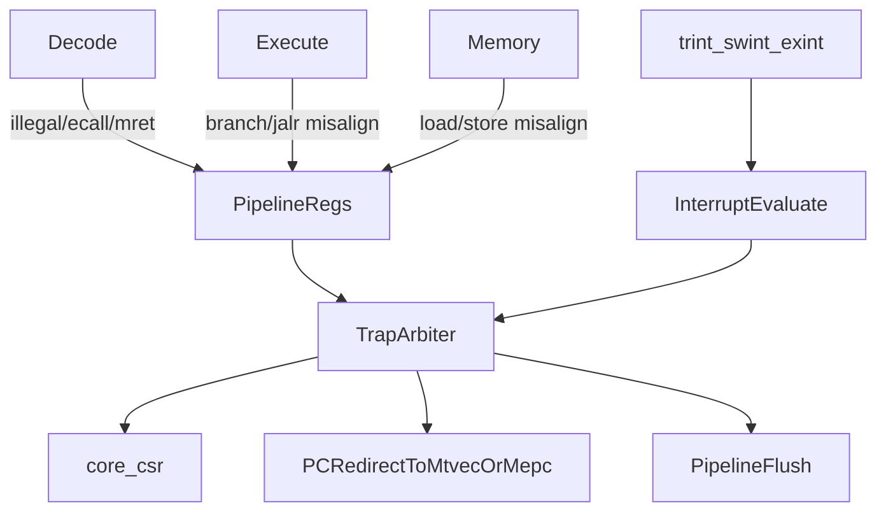

# Lab6 实现与报告计划

## 当前结论

- 当前分支是 `lab6`，`Makefile` 已提供 `test-lab6`，命令使用 `TEST=sys ./build/emu --no-diff -i ./ready-to-run/lab6/lab6-test.bin`。
- `ready-to-run/lab6/lab6-test.bin` 和反汇编 `lab6-test.S` 均存在，后续可以实际运行 Lab6 测试。
- 当前 RTL 已有 Lab5 基础：`[vsrc/src/core.sv](/home/thesumst/Data2/development/ComputerOrganization/26-Arch/vsrc/src/core.sv)` 中有 `ECALL`/`MRET` WB 边界重定向，`[vsrc/src/core_csr.sv](/home/thesumst/Data2/development/ComputerOrganization/26-Arch/vsrc/src/core_csr.sv)` 中有 `mstatus/mepc/mcause/mie/mip` 等 CSR 骨架，`[vsrc/SimTop.sv](/home/thesumst/Data2/development/ComputerOrganization/26-Arch/vsrc/SimTop.sv)` 已接入 `trint/swint/exint`。
- 缺口集中在：非法指令、取指/访存地址不对齐、统一 trap 仲裁、三类中断 evaluate、`mip` 硬件 pending 合并、trap flush 与访存请求时序。

## 推荐方案

采用“在现有 WB 精确提交基础上扩展统一 trap 控制”的保守方案，而不是重构流水线或新增复杂异常队列。

- 方案 A：最小补丁，继续只在 WB 处理所有 trap。实现简单，但访存不对齐和中断 `mepc` 时机容易被迫绕路。
- 方案 B：在现有流水线中传递 `exception_valid/cause/tval`，最终在提交边界统一进入 trap。更贴合当前设计，也便于保证精确异常。
- 方案 C：新增完整 trap controller 模块并重做 flush/stall 协议。结构更完整，但改动面和风险偏大。

我建议采用方案 B：新增少量异常元信息沿流水线传递，`core.sv` 中统一仲裁异常、`ECALL`、`MRET` 和中断；CSR 文件只负责状态保存和读写视图。

## 实施步骤

1. 扩展解码与公共类型：在 `[vsrc/include/common.sv](/home/thesumst/Data2/development/ComputerOrganization/26-Arch/vsrc/include/common.sv)` 的 `decode_out_t` 中加入非法指令标志，在 `[vsrc/src/core_decode.sv](/home/thesumst/Data2/development/ComputerOrganization/26-Arch/vsrc/src/core_decode.sv)` 对未知 opcode、非法 `SYSTEM funct3=000` 变体等标记 `illegal`。
2. 泛化 CSR trap 接口：在 `[vsrc/src/core_csr.sv](/home/thesumst/Data2/development/ComputerOrganization/26-Arch/vsrc/src/core_csr.sv)` 中支持 trap 写 `mtval`，让 `mip` 读视图合并硬件中断 pending 位，并在 `mret` 时按 Lab6 要求恢复 `mstatus`。
3. 在 `[vsrc/src/core.sv](/home/thesumst/Data2/development/ComputerOrganization/26-Arch/vsrc/src/core.sv)` 中加入异常元信息：覆盖指令地址不对齐、非法指令、load/store 地址不对齐、`ecall`，并按 Lab6/特权规范选择 `mcause`。
4. 实现中断 evaluate：将 `swint/trint/exint` 映射到 `mip[3]/mip[7]/mip[11]`，在流水线可前进并有新取指边界时检查 `(mode != M || mstatus.MIE) && (mip & mie)`，优先级建议外部中断、时钟中断、软件中断。
5. 统一 trap redirect/flush：trap 写 `mepc/mcause/mtval/mstatus`，`pc` 跳转 `mtvec`；`mret` 跳转 `mepc`；对当周期未真正完成的 `dreq` 保守取消，已经等待返回的访存保持到 `data_ok` 后再清空流水线。
6. 运行验证并迭代：先跑 `make test-lab6`，通过标准是出现 `Privileged test finished.`；若失败，按首个失败阶段定位到异常 cause、`mepc`、`mstatus` 或中断时机。通过后回归 `make test-lab4`、`make test-lab5`，确认 CSR/trap/MMU 没被破坏。
7. 编写报告：参考 `[Doc/Lab3/report.md](/home/thesumst/Data2/development/ComputerOrganization/26-Arch/Doc/Lab3/report.md)` 的学生视角与结构，写入 `[Doc/Lab6/report.md](/home/thesumst/Data2/development/ComputerOrganization/26-Arch/Doc/Lab6/report.md)`，并同步提交版 `[docs/report.md](/home/thesumst/Data2/development/ComputerOrganization/26-Arch/docs/report.md)`。内容覆盖实验目标、总体设计、异常与中断实现、关键问题、测试结果和大模型使用说明。
8. 更新项目快照：若实现和验证完成，更新 `[.agents/skills/26-arch-project-assistant/status.md](/home/thesumst/Data2/development/ComputerOrganization/26-Arch/.agents/skills/26-arch-project-assistant/status.md)` 中 Lab6 支持边界和测试结果；必要时补充 `[.agents/skills/26-arch-project-assistant/verification.md](/home/thesumst/Data2/development/ComputerOrganization/26-Arch/.agents/skills/26-arch-project-assistant/verification.md)` 的 `test-lab6` 判据。

## 验收标准

- `make test-lab6` 输出包含 `Privileged test finished.`。
- `make test-lab4`、`make test-lab5` 不出现新增回归。
- `docs/report.md` 可直接参与 `make handin` 打包；Lab6 不要求上板，因此报告不加入 Vivado/串口截图占位。
- 若时间允许再考虑 Bonus：MMU 缺页异常和报告中的时钟中断处理程序片段；默认先完成非 Bonus 满分要求。