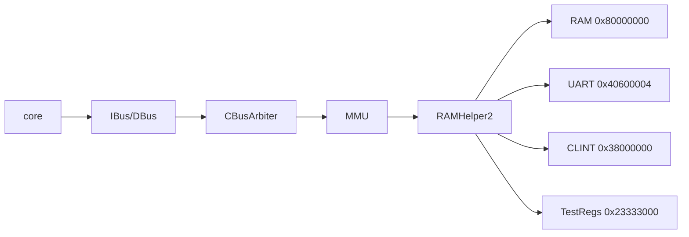
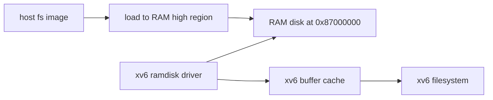

# Lab+ xv6 主 Track 启动尝试报告

## 目标

任务 11 的原始目标是让 difftest 环境下输出完整 xv6 启动信息，并尽量进入用户终端。本轮按确认后的范围推进：

- 只基于当前仓库已有内容，不引入外部 xv6 源码、`kernel.bin` 或 `fs.img`。
- 先确认现有 Lab5 裁剪内核能到哪里。
- 定位完整 xv6 主 Track 的真实阻塞点。
- 以 RAM disk 作为后续文件系统方向，暂不实现重型 virtio-mmio。

因此，本报告不是“完整 xv6 已进入 shell”的结果，而是一次可复现的启动尝试和缺口定位。

## 当前已有入口

仓库目前没有完整 xv6 镜像、源码树或文件系统镜像：

- 未发现 `fs.img`。
- 未发现完整 xv6 命名镜像或上游 xv6 源码目录。
- `Makefile` 没有完整 xv6 target。

最接近完整 OS 的入口是：

- `make test-lab5`：运行 `ready-to-run/lab5/kernel.bin`，这是课程裁剪版 xv6 内核。
- `make test-lab5-extra`：运行 `ready-to-run/lab5_yzy/kernel_bonus.bin`，用于 S-mode delegation/`sret` 小闭环。

`ready-to-run/lab5/kernel.asm` 的主流程为：

```text
xv6 kernel is booting
kinit
procinit
trapinit
plicinit
userinit
scheduler
```

但该镜像没有完整文件系统路径：

- 未见 `virtio` / `disk` / `fsinit` / `bread` / `bwrite` / `binit` 等符号。
- `plicinit()` 是空实现。
- 内置 `initcode` 仅执行自定义 `SYS_INIT`，随后打印 `Return from init! Test passed`。

这说明当前 Lab5 镜像是裁剪内核，不是可进入 shell 的完整 xv6。

## 仿真设备现状

difftest 仿真主路径为：



`difftest/src/test/vsrc/common/ram.sv` 当前支持：

- RAM：`0x8000_0000` 起，256 MiB。
- UART TX：`0x4060_0004`。
- UART ready：`0x4060_0008`。
- CLINT `msip/mtimecmp/mtime`：`0x3800_0000`、`0x3800_4000`、`0x3800_bff8`。
- 测试寄存器：`0x2333_3000`、`0x2333_3008`。

当前不支持：

- virtio-mmio。
- PLIC 外部中断。
- 可被 xv6 磁盘驱动使用的块设备 MMIO。
- 接入 RTL 的 SDCard/Flash 访问通路。

虽然 `difftest/src/test/csrc/common/sdcard.cpp` 有 `sd_setaddr()` / `sd_read()`，但：

- `difftest/config/config.h` 中 `SDCARD_IMAGE` 默认注释。
- `RAMHelper2` 没有导入这些 DPI 函数。
- 也没有地址解码把 CPU 访存接到 SDCard C++ 桩。

## 验证结果

本轮重新建立了任务 11 的护栏基线。

### 构建

- `make sim`：通过。

### Lab5 裁剪内核

命令：

```bash
make test-lab5 VOPT='-C 8000000 --force-dump-result'
```

关键输出：

```text
xv6 kernel is booting
Return from init! Test passed
EXCEEDING CYCLE/INSTR LIMIT at pc = 0x0
```

解释：`Return from init! Test passed` 是通过线；随后在显式 cycle cap 停止属于既有现象。

### S-mode bonus

命令：

```bash
make test-lab5-extra VOPT='-C 8000000 --force-dump-result'
```

关键输出：

```text
BVhHhSPCore 0: HIT GOOD TRAP at pc = 0x800002b4
```

该测试覆盖 `mret -> S-mode -> sret -> U-mode ecall -> delegated S-trap -> sret`。

### Lab6 特权回归

命令：

```bash
make test-lab6 VOPT='-C 8000000 --force-dump-result'
```

关键输出：

```text
Single test passed.
Privileged test finished.
Exit with code = 0
EXCEEDING CYCLE/INSTR LIMIT at pc = 0x0
```

解释：`Privileged test finished.` 和 `Exit with code = 0` 是通过线；后续 cycle cap 停止属于既有现象。

### Lab+3 原子回归

命令：

```bash
make test-labplus-3 VOPT='-C 8000000 --force-dump-result'
```

关键输出：

```text
Core 0: HIT GOOD TRAP at pc = 0x800000dc
```

## 完整 xv6 的主要阻塞点

按当前仓库状态，完整 xv6 不能直接以 shell 作为验收目标，原因如下。

1. 缺少完整 xv6 软件输入：
   - 仓库没有完整 xv6 源码、完整 `kernel.bin` 或 `fs.img`。
   - 当前 Lab5 镜像是裁剪版，已经在 `SYS_INIT` 处结束测试。

2. 缺少块设备或文件系统来源：
   - 标准 xv6 用户态需要文件系统镜像。
   - 当前仿真设备没有磁盘 MMIO，也没有 RAM disk 加载协议。

3. 设备地址与标准 xv6 不匹配：
   - 当前 UART 是 `0x4060_0004`。
   - 标准 QEMU xv6 常见 UART/virtio 地址不是这套平台地址。
   - 直接加载上游 xv6 镜像大概率会在早期 MMIO 或 virtio 初始化处卡住。

4. S-level interrupt 和权限细节仍有后续风险：
   - 任务 10 已打通 S-mode trap/delegation/`sret` 核心闭环。
   - 但完整 S-level interrupt pending/priority、PLIC、`SUM/MXR/TSR/TW/TVM` 仍不是本轮已完成范围。

## RAM disk 优先方案草案

由于本轮不引入外部 xv6，也不实现 virtio-mmio，后续若继续推进完整 xv6，推荐先走 RAM disk，而不是 virtio。

### 方案定位

RAM disk 的目标是先解决“内核能从哪里读文件系统块”的问题，让系统可以绕过复杂设备协议，尽早验证：

- S-mode trap。
- page fault。
- 用户态加载。
- 32-bit AMO。
- 基本系统调用路径。

### 建议接口

建议后续采用内存映射的只读 RAM disk：

- RAM disk 基址：放在主内存高端，例如 `0x8700_0000`。
- RAM disk 大小：先预留 8 MiB 或 16 MiB，不能超过当前 256 MiB RAM 上限。
- 加载方式：仿真启动时把文件系统镜像加载到 RAM 的固定偏移。
- 访问方式：内核磁盘驱动不走 MMIO 命令寄存器，而是按块号直接从该物理内存区域拷贝。
- 页表要求：内核页表需要映射 RAM disk 区域；用户态不直接映射。

示意：



### 为什么先不做 virtio

virtio-mmio 至少需要处理：

- Magic/Version/DeviceID/VendorID。
- Status 协商。
- Feature 协商。
- Queue 描述符。
- Available/Used ring。
- QueueNotify。
- 中断或轮询完成。

这会把任务从 CPU/特权架构验证扩大成设备协议移植。当前阶段更适合用 RAM disk 快速验证 xv6 主路径。

### 当前不能立即落地的原因

仓库没有完整 xv6 源码或可修改的磁盘驱动，因此本轮不强行写 RAM disk RTL 或 C++ 加载代码。否则会产生一个没有软件消费者的接口，无法验证。

RAM disk 方案需要下一轮至少补齐其中一项：

- 提供可修改的 xv6 源码。
- 提供已适配 RAM disk 的内核镜像。
- 允许在仓库中引入一个最小 xv6/用户态构建流。

## 结论

任务 11 本轮完成了启动尝试和缺口定位：

- 当前仓库能稳定运行 Lab5 裁剪 xv6 到 `Return from init! Test passed`。
- S-mode trap/delegation/`sret` 和 Lab+3 原子回归仍通过。
- 仿真设备明确缺少完整 xv6 所需的块设备或 RAM disk 入口。
- 在不引入外部完整 xv6 的前提下，无法直接验证进入 shell。

下一步若继续推进完整 xv6，建议先提供或引入可修改的 xv6 源码，然后优先实现 RAM disk 驱动与镜像加载；等能读文件系统和进入用户态后，再考虑 PLIC、virtio 或更完整 S-level interrupt 语义。
