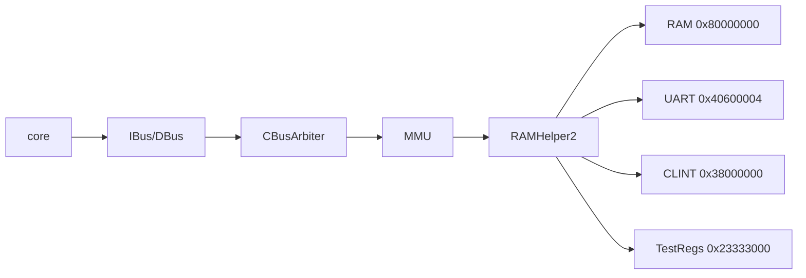
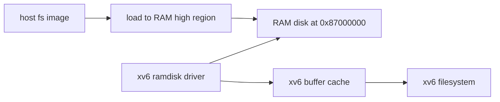

# Lab+ xv6 主 Track 启动尝试报告

## 目标

任务 11 的原始目标是让 difftest 环境下输出完整 xv6 启动信息，并尽量进入用户终端。本轮按确认后的范围推进：

- 只基于当前仓库已有内容，不引入外部 xv6 源码、`kernel.bin` 或 `fs.img`。
- 先确认现有 Lab5 裁剪内核能到哪里。
- 定位完整 xv6 主 Track 的真实阻塞点。
- 以 RAM disk 作为后续文件系统方向，暂不实现重型 virtio-mmio。

因此，本报告不是“完整 xv6 已进入 shell”的结果，而是一次可复现的启动尝试和缺口定位。

## 当前已有入口

仓库目前没有完整 xv6 镜像、源码树或文件系统镜像：

- 未发现 `fs.img`。
- 未发现完整 xv6 命名镜像或上游 xv6 源码目录。
- `Makefile` 没有完整 xv6 target。

最接近完整 OS 的入口是：

- `make test-lab5`：运行 `ready-to-run/lab5/kernel.bin`，这是课程裁剪版 xv6 内核。
- `make test-lab5-extra`：运行 `ready-to-run/lab5_yzy/kernel_bonus.bin`，用于 S-mode delegation/`sret` 小闭环。

`ready-to-run/lab5/kernel.asm` 的主流程为：

```text
xv6 kernel is booting
kinit
procinit
trapinit
plicinit
userinit
scheduler
```

但该镜像没有完整文件系统路径：

- 未见 `virtio` / `disk` / `fsinit` / `bread` / `bwrite` / `binit` 等符号。
- `plicinit()` 是空实现。
- 内置 `initcode` 仅执行自定义 `SYS_INIT`，随后打印 `Return from init! Test passed`。

这说明当前 Lab5 镜像是裁剪内核，不是可进入 shell 的完整 xv6。

## 仿真设备现状

difftest 仿真主路径为：



`difftest/src/test/vsrc/common/ram.sv` 当前支持：

- RAM：`0x8000_0000` 起，256 MiB。
- UART TX：`0x4060_0004`。
- UART ready：`0x4060_0008`。
- CLINT `msip/mtimecmp/mtime`：`0x3800_0000`、`0x3800_4000`、`0x3800_bff8`。
- 测试寄存器：`0x2333_3000`、`0x2333_3008`。

当前不支持：

- virtio-mmio。
- PLIC 外部中断。
- 可被 xv6 磁盘驱动使用的块设备 MMIO。
- 接入 RTL 的 SDCard/Flash 访问通路。

虽然 `difftest/src/test/csrc/common/sdcard.cpp` 有 `sd_setaddr()` / `sd_read()`，但：

- `difftest/config/config.h` 中 `SDCARD_IMAGE` 默认注释。
- `RAMHelper2` 没有导入这些 DPI 函数。
- 也没有地址解码把 CPU 访存接到 SDCard C++ 桩。

## 验证结果

本轮重新建立了任务 11 的护栏基线。

### 构建

- `make sim`：通过。

### Lab5 裁剪内核

命令：

```bash
make test-lab5 VOPT='-C 8000000 --force-dump-result'
```

关键输出：

```text
xv6 kernel is booting
Return from init! Test passed
EXCEEDING CYCLE/INSTR LIMIT at pc = 0x0
```

解释：`Return from init! Test passed` 是通过线；随后在显式 cycle cap 停止属于既有现象。

### S-mode bonus

命令：

```bash
make test-lab5-extra VOPT='-C 8000000 --force-dump-result'
```

关键输出：

```text
BVhHhSPCore 0: HIT GOOD TRAP at pc = 0x800002b4
```

该测试覆盖 `mret -> S-mode -> sret -> U-mode ecall -> delegated S-trap -> sret`。

### Lab6 特权回归

命令：

```bash
make test-lab6 VOPT='-C 8000000 --force-dump-result'
```

关键输出：

```text
Single test passed.
Privileged test finished.
Exit with code = 0
EXCEEDING CYCLE/INSTR LIMIT at pc = 0x0
```

解释：`Privileged test finished.` 和 `Exit with code = 0` 是通过线；后续 cycle cap 停止属于既有现象。

### Lab+3 原子回归

命令：

```bash
make test-labplus-3 VOPT='-C 8000000 --force-dump-result'
```

关键输出：

```text
Core 0: HIT GOOD TRAP at pc = 0x800000dc
```

## 完整 xv6 的主要阻塞点

按当前仓库状态，完整 xv6 不能直接以 shell 作为验收目标，原因如下。

1. 缺少完整 xv6 软件输入：
   - 仓库没有完整 xv6 源码、完整 `kernel.bin` 或 `fs.img`。
   - 当前 Lab5 镜像是裁剪版，已经在 `SYS_INIT` 处结束测试。

2. 缺少块设备或文件系统来源：
   - 标准 xv6 用户态需要文件系统镜像。
   - 当前仿真设备没有磁盘 MMIO，也没有 RAM disk 加载协议。

3. 设备地址与标准 xv6 不匹配：
   - 当前 UART 是 `0x4060_0004`。
   - 标准 QEMU xv6 常见 UART/virtio 地址不是这套平台地址。
   - 直接加载上游 xv6 镜像大概率会在早期 MMIO 或 virtio 初始化处卡住。

4. S-level interrupt 和权限细节仍有后续风险：
   - 任务 10 已打通 S-mode trap/delegation/`sret` 核心闭环。
   - 但完整 S-level interrupt pending/priority、PLIC、`SUM/MXR/TSR/TW/TVM` 仍不是本轮已完成范围。

## RAM disk 优先方案草案

由于本轮不引入外部 xv6，也不实现 virtio-mmio，后续若继续推进完整 xv6，推荐先走 RAM disk，而不是 virtio。

### 方案定位

RAM disk 的目标是先解决“内核能从哪里读文件系统块”的问题，让系统可以绕过复杂设备协议，尽早验证：

- S-mode trap。
- page fault。
- 用户态加载。
- 32-bit AMO。
- 基本系统调用路径。

### 建议接口

建议后续采用内存映射的只读 RAM disk：

- RAM disk 基址：放在主内存高端，例如 `0x8700_0000`。
- RAM disk 大小：先预留 8 MiB 或 16 MiB，不能超过当前 256 MiB RAM 上限。
- 加载方式：仿真启动时把文件系统镜像加载到 RAM 的固定偏移。
- 访问方式：内核磁盘驱动不走 MMIO 命令寄存器，而是按块号直接从该物理内存区域拷贝。
- 页表要求：内核页表需要映射 RAM disk 区域；用户态不直接映射。

示意：



### 为什么先不做 virtio

virtio-mmio 至少需要处理：

- Magic/Version/DeviceID/VendorID。
- Status 协商。
- Feature 协商。
- Queue 描述符。
- Available/Used ring。
- QueueNotify。
- 中断或轮询完成。

这会把任务从 CPU/特权架构验证扩大成设备协议移植。当前阶段更适合用 RAM disk 快速验证 xv6 主路径。

### 完整 RAM disk 仍不能立即落地的原因

仓库没有完整 xv6 源码或可修改的磁盘驱动，因此本轮不强行实现 xv6 侧 RAM disk driver。否则会产生一个没有真实软件消费者的接口，无法验证完整文件系统路径。

RAM disk 完整方案需要下一轮至少补齐其中一项：

- 提供可修改的 xv6 源码。
- 提供已适配 RAM disk 的内核镜像。
- 允许在仓库中引入一个最小 xv6/用户态构建流。

## 后续引入方式调研

参考 Lab+ wiki 的主 Track 说明，完整 xv6 的关键并不是必须实现完整 virtio，而是要让 difftest 在 MMIO 或等价方式下能读到一个硬盘镜像；若最终不能跑通，也需要清楚记录尝试内容和卡点。官方说明也明确提到，可以修改 difftest 让 MMIO 读取虚拟硬盘文件，并把 xv6 原本的 virtio 驱动改成更简单的 MMIO 读取方式。

本轮进一步调研后，当前仓库的约束如下：

- `emu` 的 `-i/--image` 只加载一个 flat binary 或 gzip binary 到物理地址 `0x8000_0000`，不解析 ELF；本轮已补一个可选 `--fs-image` 第二镜像参数用于 RAM disk 路线。
- `FIRST_INST_ADDRESS` 和 CPU 复位 PC 都是 `0x8000_0000`，所以后续 `kernel` 必须通过 `objcopy -O binary` 变成 flat `kernel.bin`。
- 上游 xv6-riscv 标准构建会生成 `kernel/kernel` 和 `fs.img`，文件系统镜像由 `mkfs` 生成；标准磁盘路径依赖 QEMU virtio-mmio 驱动 `kernel/virtio_disk.c`，这与本仓库当前设备模型不匹配。
- 本仓库有 `sdcard.cpp` 的 C++ 桩，但没有 RTL/DPI 接线；直接启用它不如先做更简单的 RAM disk 加载链路。

因此，推荐的低风险引入路线是：

1. 保持现有 Lab5 裁剪内核作为护栏，确保 `make test-lab5` 仍能输出 `Return from init! Test passed`。
2. 引入或提供可修改的 xv6-riscv 源码，但不要直接运行未移植的上游 `kernel.bin`。
3. 先适配平台地址：
   - UART 改为当前平台的 `0x4060_0004` / `0x4060_0008`。
   - CLINT/PLIC 根据当前仿真能力裁剪，先允许 PLIC 为空或轮询。
4. 用 RAM disk 替代 virtio：
   - 方案 A：扩展 `emu` 增加 `--fs-image`，把 `fs.img` 加载到固定物理地址，例如 `0x8700_0000`。
   - 方案 B：用脚本把 `kernel.bin` padding 到固定偏移后拼接 `fs.img`，仍然保持单镜像 `-i` 加载。
   - xv6 侧新增或替换一个薄 `ramdisk` 驱动，按块号从固定物理地址拷贝数据。
5. 只在 RAM disk 路线跑到文件系统初始化后，再考虑更完整的 PLIC、S-level interrupt 或 virtio-mmio。

从实现成本看，当前最适合的小步不是直接引入上游完整 xv6，而是先做“第二镜像/RAM disk 加载链路”的微型自测。本轮已完成该小步：

- `emu` 新增 `--fs-image=FILE`，把第二镜像加载到物理地址 `0x8700_0000`。
- `difftest/src/test/csrc/common/ram.cpp` 新增 `load_ram_image_at()`，用于把 host 文件放入模拟 RAM 的固定物理偏移。
- 新增 `ready-to-run/lab+/11/gen_ramdisk_magic_test.py`，生成：
  - `ramdisk_magic_test.bin`
  - `ramdisk_magic_test.S`
  - `ramdisk_magic.img`
- 裸机测试从 `0x8700_0000` 读取 magic `0x12345678`，匹配后 good trap。

验证命令：

```bash
make sim
./build/emu --no-diff -i ./ready-to-run/lab+/11/ramdisk_magic_test.bin --fs-image ./ready-to-run/lab+/11/ramdisk_magic.img -C 20000 -I 1000
```

关键输出：

```text
Loaded 4 bytes from ./ready-to-run/lab+/11/ramdisk_magic.img to 0x87000000
Core 0: HIT GOOD TRAP at pc = 0x80000028
```

补充说明：为让 `--no-diff` 裸机诊断能 clean 退出，`emu` 主循环现在即使禁用参考模型比对，也会读取 RTL 侧 trap event；diff 模式下仍继续执行原有参考模型比对。

这个阶段不需要完整 xv6 源码，就能验证仿真加载链路；通过后再接 xv6 ramdisk 驱动。

## xv6 源码引入与构建入口

在 RAM disk 加载链路通过后，本轮继续推进了下一个小步：引入可修改的 upstream `xv6-riscv` 源码，作为后续替换磁盘驱动、适配平台地址和生成 `fs.img` 的软件基础。

当前落地内容：

- 新增普通源码目录：`third_party/xv6-riscv/`。
- 不使用 submodule，便于后续直接修改 `kernel/virtio_disk.c`、`kernel/memlayout.h`、`kernel/uart.c` 等平台相关文件。
- 顶层 `Makefile` 新增 `labplus-xv6-build`：
  - 调用 `third_party/xv6-riscv` 构建 `kernel/kernel` 和 `fs.img`。
  - 工具链可用时，用 `objcopy -O binary` 导出 `ready-to-run/lab+/11/xv6-kernel.bin`。
  - 同步复制 `fs.img` 为 `ready-to-run/lab+/11/xv6-fs.img`。

验证命令：

```bash
make labplus-xv6-build
```

当前结果：

```text
riscv64-unknown-elf-gcc: 没有那个文件或目录
qemu-system-riscv64: not found
```

解释：当前机器 `PATH` 中没有 RISC-V GCC/binutils，也没有 QEMU RISC-V。源码和构建入口已经准备好，但还不能产出 `kernel.bin` / `fs.img`。安装工具链后可重跑：

```bash
make labplus-xv6-build XV6_TOOLPREFIX=riscv64-unknown-elf-
```

若使用其他工具链前缀，可改为例如：

```bash
make labplus-xv6-build XV6_TOOLPREFIX=riscv64-linux-gnu-
```

## S-mode timer 诊断尝试

完整 xv6 还依赖 S-mode timer interrupt。为低成本定位该风险，本轮新增一个诊断生成器：

- `ready-to-run/lab+/11/gen_smode_timer_diag.py`
- `ready-to-run/lab+/11/smode_timer_diag.bin`
- `ready-to-run/lab+/11/smode_timer_diag.S`

测试意图：

- M-mode 设置 `stvec`、`mideleg.STIP`、timer pending 和 `mstatus.MPP=S/SIE=1`。
- `mret` 进入 S-mode 后等待 timer interrupt。
- 若进入 S-trap，则认为 S-mode timer delegation 路径具备最小闭环。
- 若进入 M-trap 或无法触发，则记录为完整 xv6 后续风险。

当前运行结果：

```text
./build/emu --no-diff -i ready-to-run/lab+/11/smode_timer_diag.bin -C 200000 --force-dump-result
EXCEEDING CYCLE/INSTR LIMIT at pc = 0x80000034 / 0x80000014
```

该诊断暂未形成 clean good/bad trap。结合当前 `core_trap_ctrl.sv`，中断 pending 仍主要按 machine interrupt bit 和 machine cause 处理，S-level timer pending/cause 的完整语义仍需要后续专门处理。考虑到该诊断已经开始牵涉中断生成、委托 cause 映射和测试构造细节，本轮按“小步推进”原则先暂停深入实现，仅保留诊断资产和记录。

## 结论

任务 11 本轮完成了启动尝试和缺口定位：

- 当前仓库能稳定运行 Lab5 裁剪 xv6 到 `Return from init! Test passed`。
- S-mode trap/delegation/`sret` 和 Lab+3 原子回归仍通过。
- 仿真侧已具备 RAM disk/第二镜像加载入口，并已引入可修改 xv6 源码；当前缺少本机 RISC-V 工具链，尚不能生成 `kernel.bin` / `fs.img`。
- 在不引入外部完整 xv6 的前提下，无法直接验证进入 shell。
- RAM disk 加载链路微型自测已通过；后续最推荐在工具链可用后接入 xv6 侧 ramdisk 驱动。

下一步若继续推进完整 xv6，建议先安装或提供 RISC-V GCC/binutils，然后构建 `xv6-kernel.bin` / `xv6-fs.img`；随后优先实现 xv6 侧 RAM disk 驱动。等能读文件系统和进入用户态后，再考虑 PLIC、virtio 或更完整 S-level interrupt 语义。
