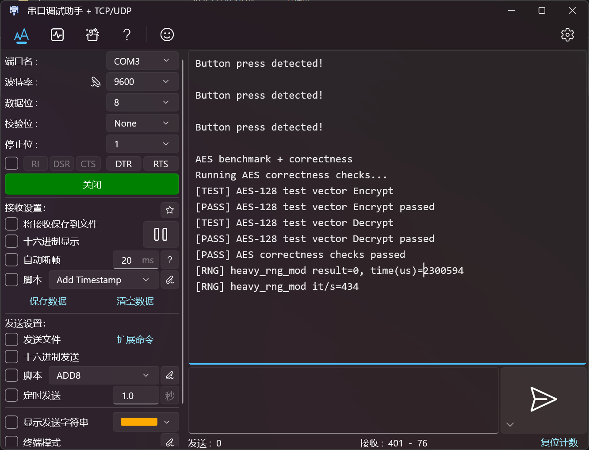

# Lab3 实验报告

姓名：朱文凯  
学号：23307110192  

## 1. 实验目标

本次 Lab3 的目标是在前两次实验已经完成基础整数运算与访存支持的五级流水线 CPU 上，进一步补齐控制流、比较和移位相关功能，并通过 `make test-lab3` 测试。  
根据实验要求，本次需要支持的指令包括：

- 分支指令：`beq`、`bne`、`blt`、`bge`、`bltu`、`bgeu`
- 立即数比较与移位：`slti`、`sltiu`、`slli`、`srli`、`srai`
- 寄存器比较与移位：`sll`、`slt`、`sltu`、`srl`、`sra`
- 32 位宽版本：`slliw`、`srliw`、`sraiw`、`sllw`、`srlw`、`sraw`
- PC 相关指令：`auipc`、`jal`、`jalr`

与 Lab2 相比，这一阶段的重点不再是“数据从哪里来、怎么写回”，而是：

- 分支与跳转目标地址是否计算正确
- `PC` 是否能在正确时刻被重定向
- 流水线在控制流改变时是否能正确 flush
- `jal` / `jalr` 的链接地址 `pc + 4` 是否能稳定写回
- 在加入控制流之后，已有的 forwarding、stall、访存等待和 Difftest 提交是否还能保持一致

---

## 2. 总体设计思路

这次实现遵循“先补控制语义，再补执行能力，最后修流水线控制与板级细节”的思路。

### 2.1 先补齐 Lab3 的译码与控制语义

第一步不是直接修改 `PC`，而是先在译码阶段补齐 Lab3 所需的控制信息。

主要工作包括：

- 为分支指令标记 `is_branch`
- 为 `jal` / `jalr` 标记 `is_jump`
- 为 `jalr` 单独标记 `is_jalr`
- 为 `auipc` 增加 `use_pc`，让 ALU 使用 `pc` 参与运算
- 为 `jal` / `jalr` 增加新的写回来源 `WB_PC4`
- 为移位与比较指令补齐对应的 `alu_op`

这样做的原因是：  
Lab3 的难点并不只是“多了几条指令”，而是这些指令会影响 ALU 输入来源、写回来源和前端取指方向。如果译码阶段不能先把这些语义表达清楚，后面的 EX 和 PC 控制就很容易变得混乱。

### 2.2 在 EX 阶段统一完成比较、目标计算与跳转判定

我仍然保留了五级流水线的整体结构，没有为了 Lab3 重新拆阶段。  
控制相关的关键决策统一放在 EX 阶段完成：

- 分支比较在 EX 阶段完成
- 分支目标地址由 `pc_ex + imm_ex` 计算
- `jal` 目标地址由 `pc_ex + imm_ex` 计算
- `jalr` 目标地址由 `rs1 + imm` 计算，并清零最低位

这样做的优点是：

- 可以复用现有 forwarding 结果
- 比较时直接使用 EX 阶段已经前递后的操作数
- 不需要把过多复杂逻辑提前塞进 ID 阶段

代价是：

- 分支在 EX 才决断，前面已经取到的错误路径指令需要 flush

不过对于 Lab3 的功能正确性目标，这种“EX 决断 + flush”的方案足够直接，也更容易调试。

### 2.3 用保守的 flush 策略先保证正确性

Lab3 的核心新增问题是控制冒险。  
当前实现没有做分支预测，而是采用最直接的策略：

- 正常情况下 `next_pc = pc + 4`
- 如果 EX 阶段确认跳转或分支成立，则重定向到目标地址
- 同时清空错误路径上的前级流水寄存器

这套策略性能不是最优，但优点是：

- 行为容易解释
- 和当前五级流水结构兼容
- 更适合先通过实验测试

---

## 3. 主要实现内容

### 3.1 `common.sv`

这一部分主要做了两类扩展：

- 扩展 `alu_op_t`
  - 增加 `SLL/SRL/SRA`
  - 增加 `SLT/SLTU`
  - 增加 `SLLW/SRLW/SRAW`
- 引入新的写回来源类型 `wb_sel_t`
  - `WB_ALU`
  - `WB_MEM`
  - `WB_PC4`

此外，在 `decode_out_t` 中新增了：

- `use_pc`
- `is_branch`
- `is_jump`
- `is_jalr`

这样做之后，译码、执行和写回之间的控制关系会更清晰，而不是继续把所有语义都挤压到单个 `wb_sel` 或 `alu_src` 上。

### 3.2 `core_decode.sv`

这一部分是 Lab3 功能扩展的入口。

主要补充了以下译码：

- 分支类：`beq`、`bne`、`blt`、`bge`、`bltu`、`bgeu`
- 立即数移位类：`slli`、`srli`、`srai`
- 立即数比较类：`slti`、`sltiu`
- 寄存器移位类：`sll`、`srl`、`sra`
- 寄存器比较类：`slt`、`sltu`
- 32 位移位类：`slliw`、`srliw`、`sraiw`、`sllw`、`srlw`、`sraw`
- `auipc`
- `jal`
- `jalr`

其中最关键的三个特殊语义是：

1. `auipc` 不是普通立即数写回，而是 `pc + imm`
2. `jal` / `jalr` 的写回值不是 ALU 结果，而是 `pc + 4`
3. `jalr` 的跳转目标最低位必须清零

### 3.3 `core_alu.sv`

ALU 在 Lab3 中从“基础整数运算器”扩展成了真正意义上的控制流辅助运算器。

本次新增的内容包括：

- `SLL` / `SRL` / `SRA`
- `SLT` / `SLTU`
- `SLLW` / `SRLW` / `SRAW`

对于 32 位宽版本，仍然沿用前两次实验里已经建立的思路：

- 先在 32 位范围内运算
- 再把结果符号扩展到 64 位

这样可以保证 RV64 中 W 型指令语义和前两次设计保持一致。

### 3.4 `core_forwarding_unit.sv`

Lab3 里一个容易被忽略的问题是：  
`jal` 和 `jalr` 写回的不是普通 ALU 结果，而是 `pc + 4`。如果 forwarding 仍然只会前递 `alu_result_mem`，那么后继指令可能会读到旧值。

因此这次把 MEM 阶段可供 forwarding 的数据统一成 `forward_data_mem`：

- 普通情况前递 ALU 结果
- `WB_PC4` 情况前递 `pc + 4`

这样可以保证链接地址回写也能正确参与后继计算。

### 3.5 `core.sv`

Lab3 改动最多的文件仍然是 `core.sv`。  
主要增加和调整了以下几部分：

- `next_pc` 不再固定为 `pc + 4`
- EX 阶段增加：
  - 分支比较
  - 跳转成立判定
  - 目标地址生成
- 在跳转 / 分支成立时：
  - 重定向 `PC`
  - 清空错误路径上的前级流水状态
- 写回阶段增加 `WB_PC4`
- `DifftestInstrCommit.skip` 改为只在低地址 MMIO 访存时跳过

另外，为了保证在更复杂 stall 场景下不丢指令，这一阶段还修了一处比较隐蔽的流水线推进问题，后面会单独讲。

---

## 4. 关键问题与修复过程

### 4.1 一开始卡在 `auipc`

在最初的实现状态里，Lab3 不是“只差几个 branch 指令”，而是控制流主链路根本没有真正建立起来。  
虽然译码里已经能提取出 B/J/U 类立即数，但：

- `next_pc` 仍固定为 `pc + 4`
- `auipc` 没有真正形成 `pc + imm` 写回
- `jal` / `jalr` 没有真正改变前端流向

这会导致程序在非常早期就和参考模型分叉。  
因此最先要做的不是微调 flush，而是先把 `auipc`、`jal`、`jalr` 和 branch 的控制语义真正接通。

### 4.2 控制冒险的本质不是“跳错一次”，而是“错误路径已经进了流水线”

Lab3 中最典型的新问题是：

- 前端已经按顺序继续取了后面的指令
- EX 阶段才发现应该跳转

如果只修改 `PC`，而不清理已经流进来的错误指令，就会出现：

- Difftest 报 PC 错
- 某些寄存器值在几拍之后才开始异常
- 表面像是比较逻辑错，实际上是错误路径指令被执行了

修复方法是：

- 在 EX 阶段产生 `redirect_fire_ex`
- 一旦成立，更新 `pc`
- 同时清空 `IF_ID` 和 `ID_EX` 中的错误路径内容

这个处理方式虽然保守，但足够稳定。

### 4.3 `jal` / `jalr` 的 bug 不一定体现在跳转地址上，也可能体现在写回旁路上

一开始比较容易只盯着：

- 跳转地址对不对
- `jalr` 最低位有没有清零

但实际调试时还发现另一个容易漏掉的点：  
`jal` / `jalr` 把 `pc + 4` 写回寄存器后，如果下一条很快就用到这个寄存器，forwarding 必须能把这个值送出去。

如果 forwarding 仍然只懂普通 ALU 结果，就会出现：

- 跳转本身是对的
- 但后继依赖链接寄存器的代码算错

因此最终把 forwarding 的 MEM 前递数据改成了统一的“将被写回的数据”。

### 4.4 `load-use hazard` 和 `mem_wait` 堆叠问题

这是这次调试里最隐蔽、也最有代表性的一个问题。

现象上看，程序已经运行到中段，绝大多数控制流都正常，但在某个循环里：

- 参考模型停在某条 `lbu`
- DUT 却提前执行了后面的 `bnez`
- 某个寄存器少更新了一次

表面上很像：

- branch 比较读到了旧值
- 或者 load 数据没对

但继续看流水线状态后发现，真正的问题是：

- `load-use hazard` 和 `mem_wait` 同时出现时
- EX 中那条本该继续推进的 load 指令被错误地 bubble 掉了

也就是说，问题不在 branch 语义，而在“等待访存返回时，EX 是否还允许保留正在处理的那条 load”。

修复后，`make test-lab3` 才真正稳定跑通。

### 4.5 Lab3 要求的 `skip` 不能图省事写成常高

官方要求对低地址 MMIO 访存加入：

```verilog
.skip ((mem & memaddr[31] == 0))
```

这一步非常关键，因为 Lab3 之后程序会访问板级设备映射区域。  
如果不跳过，Difftest 无法知道设备真实状态；  
但如果为了省事把 `skip` 写得太宽，又会导致对比失效。

因此最后采用的策略是：

- 只在 `mem_read` 或 `mem_write` 成立时考虑 `skip`
- 只在地址确实落在低地址设备区时跳过

也就是只对“低地址外设访存”跳过，而不是对所有访存或所有指令跳过。

---

## 5. 测试结果

最终我运行了：

```bash
make test-lab3
```

输出结果中出现了：

```text
AES benchmark + correctness
Running AES correctness checks...
[TEST] AES-128 test vector Encrypt
[PASS] AES-128 test vector Encrypt passed
[TEST] AES-128 test vector Decrypt
[PASS] AES-128 test vector Decrypt passed
[PASS] AES correctness checks passed
[RNG] heavy_rng_mod result=0, time(us)=227606
[RNG] heavy_rng_mod it/s=4405
Core 0: HIT GOOD TRAP at pc = 0x80000030
instrCnt = 1,243,690, cycleCnt = 6,596,649, IPC = 0.188534
```

这说明：

- Lab3 所需的控制流、比较和移位功能已经能通过基线测试
- 程序能够完整运行到正确结束位置
- Difftest 没有在中途出现架构状态不一致
- 当前实现已经通过 Lab3 基本测试

从结果上看，本次 Lab3 的核心仿真目标已经完成。

---

## 6. 上板适配与验证说明

### 6.1 已完成的上板适配

在检查板级路径后，已经完成了以下适配：

- 修复 `vivado/src/device.sv` 中的声明初始化写法
  - 改为 reset 时显式初始化
- 将仿真打印限制在非综合路径
- 收紧 `device.sv` 中的 `ready` 逻辑
  - 只对真正的 UART 发送地址使用 `tx_ready`
- 在 `vsrc/mycpu_top.sv` 中将未使用中断输入显式绑为 `0`

这些适配的目标不是改变 CPU 功能，而是减少 Vivado 与 Verilator 之间的行为差异。

### 6.2 上板验证



---

## 7. 反思与总结

这次实验让我最大的感受是，Lab3 真正增加的难度不在“多支持几条指令”，而在“控制流进入流水线之后，整个 CPU 的一致性要求明显提高了”。

前两次实验中，我更多关注的是：

- ALU 运算是否正确
- load/store 通路是否接通
- forwarding 和 stall 是否到位

而到了 Lab3，我更明显地在处理：

- `PC` 在哪个阶段被修改
- 分支成立后，前面取到的错误路径指令怎么办
- `pc + 4` 写回是否会影响 forwarding
- 访存等待和控制冒险叠加时，流水线是否还会稳定推进

这次实验也让我更加明确地意识到：  
流水线 CPU 中很多表面看起来像“某条指令算错了”的问题，根因其实往往是：

- 流水线推进条件
- 有效位传播
- flush 时机
- forwarding 数据来源
- Difftest 提交时序

换句话说，Lab3 让我真正从“功能模块拼装”的视角，转向了“整个处理器作为一个时序系统如何保持一致”的视角。

此外，这次还第一次比较系统地接触了“仿真通过不等于上板稳”的问题。  
这也让我对后续实验有了更清楚的认识：

- 仿真正确只是第一步
- 板级接口、时钟、复位、工具链兼容性同样重要

---

## 8. 大模型的使用说明

本次实验中，我使用了 Cursor / Gemini 等工具作为辅助，主要用于：

- 梳理 Lab3 所需支持的指令范围
- 帮助分析 Difftest 失败点和流水线时序问题
- 协助整理控制流、flush、forwarding 相关设计思路
- 对板级路径进行静态检查并总结上板风险
- 整理实验报告结构与表述

但实际实现中最关键的部分，例如：

- 分支 / 跳转控制如何放进现有五级流水线
- `jal` / `jalr` 的写回和 forwarding 如何处理
- `load-use hazard` 与 `mem_wait` 叠加时如何避免丢指令
- `DifftestInstrCommit.skip` 如何只对 MMIO 生效
- 板级 `device.sv` 的 Vivado 兼容性修复

都经过了结合代码、日志、测试结果和实验要求的人工检查，而不是直接照搬生成内容。
